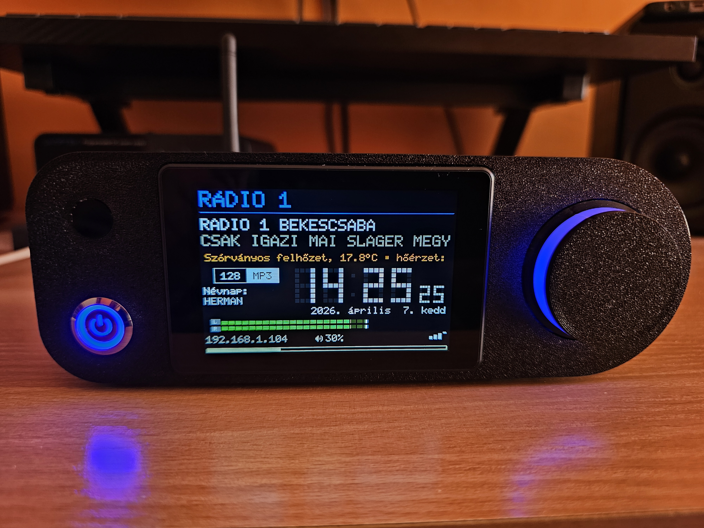
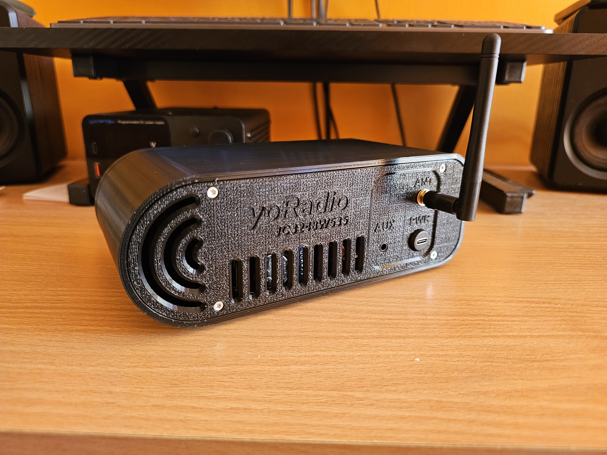
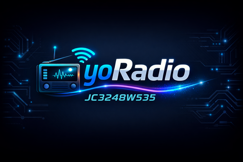

# yoRadio – Magyar verzió Guition JC3248W535 (AXS15231B) kijelzővel

ESP32-S3 alapú internet rádió **magyar nyelvű felülettel**, csak a **fő névnapok** kijelzésével és teljes támogatással a Guition JC3248W535 modulhoz (AXS15231B vezérlő + kapacitív érintőképernyő).

## 📻 A projektről

Ez a projekt egy erősen módosított **yoRadio** (eredeti: e2002/yoradio) fork.  
Célja egy egyszerűen használható, szép kinézetű, magyar nyelvű internet rádió készítése a népszerű Guition JC3248W535 ESP32-S3 kijelzős modulra.

### Főbb módosítások és javítások:
- Alap: **V-Tom** verzió
- **romekb** által hozzáadott teljes támogatás a **JC3248W535** modulhoz (AXS15231B vezérlő + kapacitív érintőképernyő)
- Teljes magyar nyelvű felület (korábbi magyar verzióban lévő hibákat kijavítottam)
- **Csak a fő magyar névnapok** jelennek meg (a másodlagosak nincsenek benne a tisztább megjelenés érdekében)
- Kisebb hibajavítások és optimalizálások a stabil működéshez
- **Egyedi bootlogo**

Youtube link: https://www.youtube.com/watch?v=H177wK0D7a4

## ✨ Funkciók
- Internet rádió (több száz magyar és külföldi állomás)
- Időjárás-jelentés és óra
- **Magyar névnapok** (csak a fő névnapok)
- Kapacitív érintőképernyő támogatás (AXS15231B)
- Webes konfiguráció (WiFi, állomások stb.)
- Alacsony fogyasztású képernyővédő üzemmód
- Egyszerű, letisztult magyar felület

## ⚙️ Konfiguráció

A projekt legfontosabb beállításai a **`myoptions.h`** fájlban találhatók (a fájlok között megtalálod).  
Itt minden lényeges dolgot konfigurálhatsz, például:
- Nyelv beállítása
- Névnapok megjelenítése
- Használt DAC típusa
- Egyéb funkciók (pl. RTC, SD kártya, IR, Rotary Encoder támogatás stb.)

Mielőtt feltöltenéd a kódot a Guition JC3248W535-re, mindenképpen nézd át és állítsd be igényeid szerint ezt a fájlt!

## 🛠️ 3D model
A saját tervezésű 3D model 3MF fájl elérhető az alábbi linken: https://makerworld.com/hu/models/2630118-yoradio-guition-jc3248w535#profileId-2904124

## 🛠️ Használt alkatrészek
Az összes szükséges alkatrész linkje megtalálható a repo **Aliexpress** mappájában.

Főbb komponensek:
- Guition JC3248W535 kijelző modul (AXS15231B vezérlővel)
- PCM5102 DAC modul
- DS3231 RTC modul

## 📥 Telepítés
1. Töltsd le a legfrissebb release-t
2. Használd az Arduino IDE-t
3. Telepítsd a megfelelő fájlt **Boards Manager**-ben (lásd: https://github.com/SzegediSzabolcs/yoRadioJC3248W535HU/blob/main/ArduinoIDE%20settings/Boards%20Manager.jpg)
4. Telepítsd a megfelelő könyvtárat a **Library Manager**-ben (lásd: https://github.com/SzegediSzabolcs/yoRadioJC3248W535HU/blob/main/ArduinoIDE%20settings/Library%20Manager.jpg)
5. Állítsd be a **"Tools"** fül alatt a megfelelő beállításokat (lásd: https://github.com/SzegediSzabolcs/yoRadioJC3248W535HU/blob/main/ArduinoIDE%20settings/ArduinoIDE%20setting.jpg)

## ❤️ Köszönet
- **e2002** – az eredeti yoRadio projektért 
- **V-Tom** – az alap verzióért
- **romekb** – a JC3248W535 (AXS15231B) támogatás hozzáadásáért
- Mindenkinek, aki a magyar fordításhoz hozzájárult

---

Ha tetszik a projekt, adj egy ⭐-t a repónak!  
Kérdésed vagy javaslatod van? Nyugodtan nyiss Issue-t.

**Kellemes rádiózást! 🎵**
